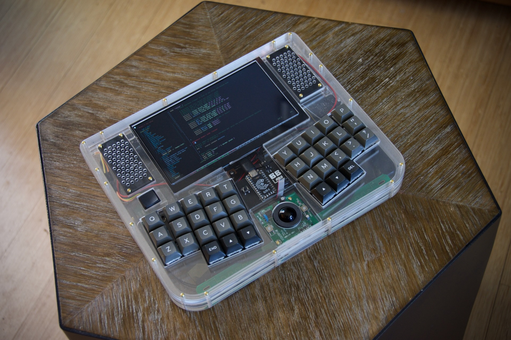
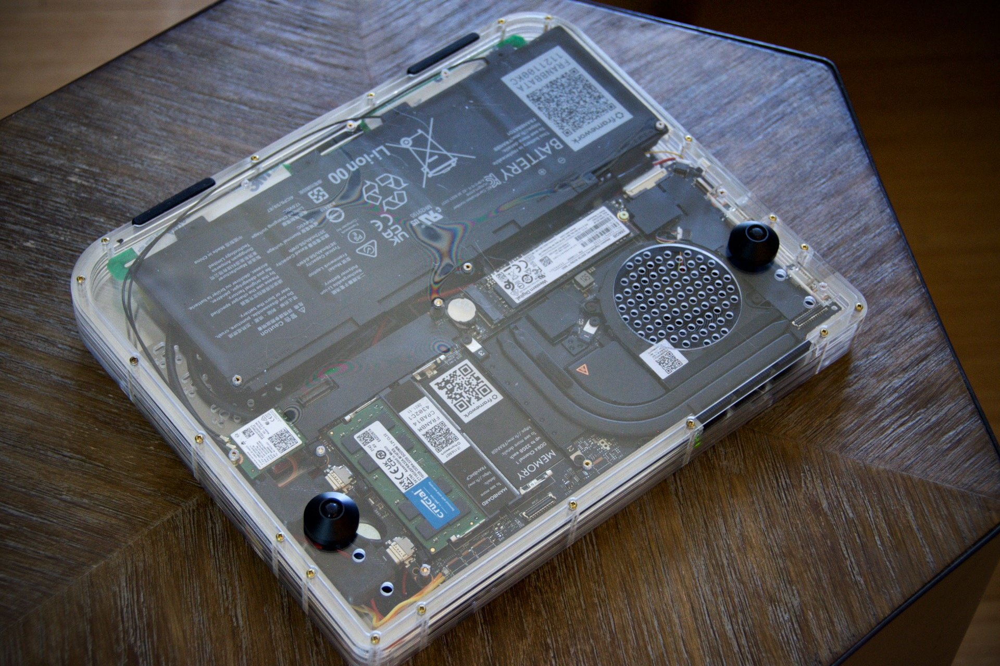
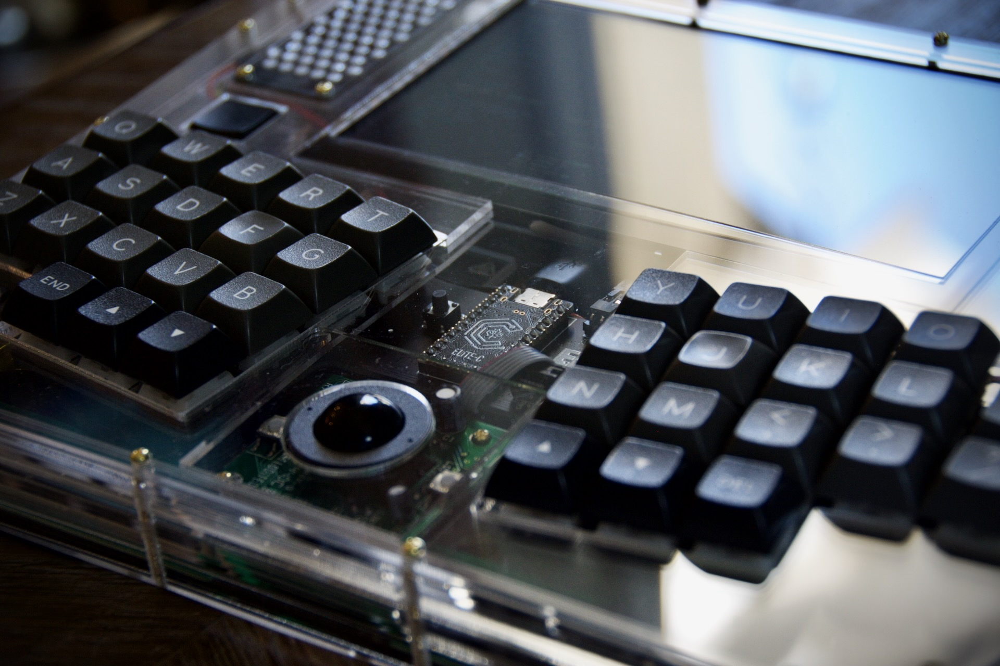

# framedeck

A Cyberdeck built with the framework mainboard.  

[Framework](https://frame.work) has 
created a really slick, fully user servicable, laptop and have recently started selling the 
[mainboard](https://frame.work/marketplace/mainboards) as a SBC for general 
use.  To better support folks who may want to integrate it into their projects, they are also 
releasing [technical documentation](https://github.com/FrameworkComputer/Mainboard) including 
pinouts, cad models and other resources.

As they were preparing this documentation release, they emailed me to see if I'd be interested
in a collaboration of sorts.  They would provide one of their laptops and some additional modules
for me to build something unique with the only condition being that I released the designs 
for public use.  So here we are!

The mainboard is a great little unit, being a full Intel based system on a single board with 
great storage and memory expansion, decent on-board graphics and full power management.  Since
it was designed to fit into the laptop first and foremost, some of the connectors are fairly
specialized, but with the pinouts available there are a lot of opportunities for expansion. The
board also has four standard USB-C ports which provide many possibilities without even trying
any of the other on-board connectors.

That's all to say that when they reached out and explained thier plans and offered to let 
me play with one, I jumped at the chance and this is what I came up with after some experimentation.

It's my take on the slab style computers that were somewhat popular before the world settled
on clamshell designs for portable computers.  I really wanted a 
[TRS-80 model 100](https://en.wikipedia.org/wiki/TRS-80_Model_100) when I was young so this
sort of design was a big influence.

To complete the unit I added battery from the framework laptop, custom mechanical keyboard, wifi card, 
ssd storage, 16gb of memory, 7" IPS display and some speakers in the hopes of making a fairly useful 
computer.  I ended up using the mainboard with their battery rather than roll my own power solution as
it has solid capacity and is already desinged to work with the onboard power management.  For
other uses the mainboard can be powered via USB-C, so a solid powerbank would provide plenty 
of runtime or it can run off any USB-C power brick for stationary use.

For the case, I wanted something interesting that showed off the mainboard, custom keyboard PCB and 
just looked unusual... so clear acrylic and brass won the day!  I thought about 3d printing, and 
I could have done it in several sections, but building the unit up with layers of laser-cut acrylic 
offered some interesting challenges and opportunities.  

Consider this repo a sort of 'guided tour' to give some inspiration and show what might be done with the
framework mainboard.  I'll highlight some things that I think are interesting, or that were tricky, but 
it's not meant to be a comprehensive guide so all the normal caveats apply if you
want to dive in and build something based off this material.  I'm including all of
my design files for reference, but there are lots of details of the build I probably won't cover.  
If you want to build one, or something similar, feel free to reach out and I'd be happy to answer
and questions or provide advice.

* [Build Tour](docs/build_tour.md)
* [Parts List](docs/parts.md)
* [Case Layers](case/layers.md)
* [3d Printed Bits](printed_parts/bits.md)
