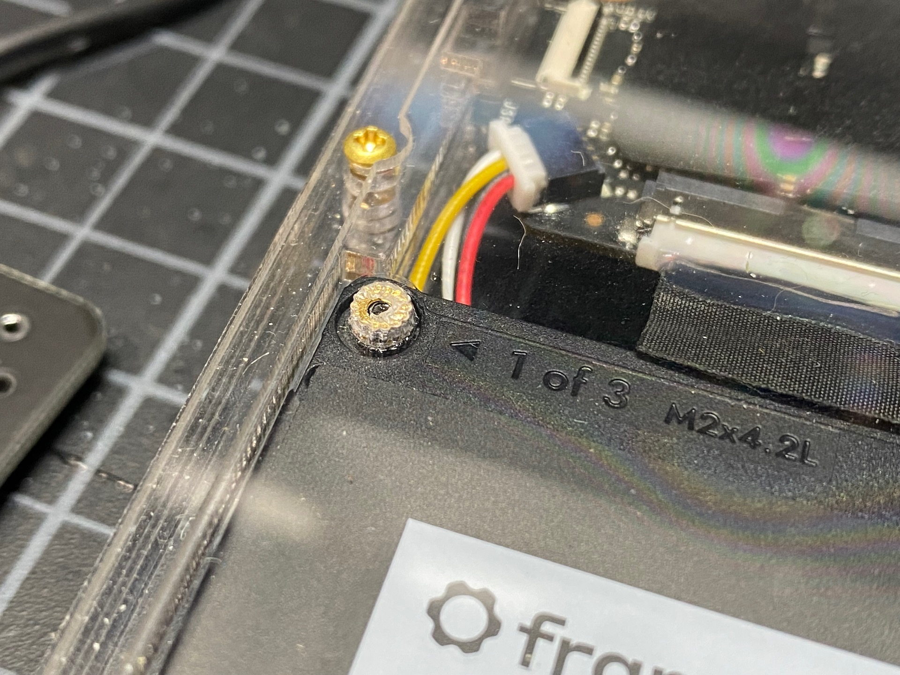
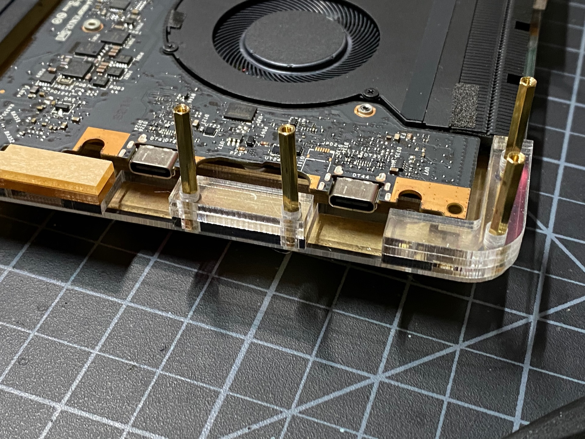
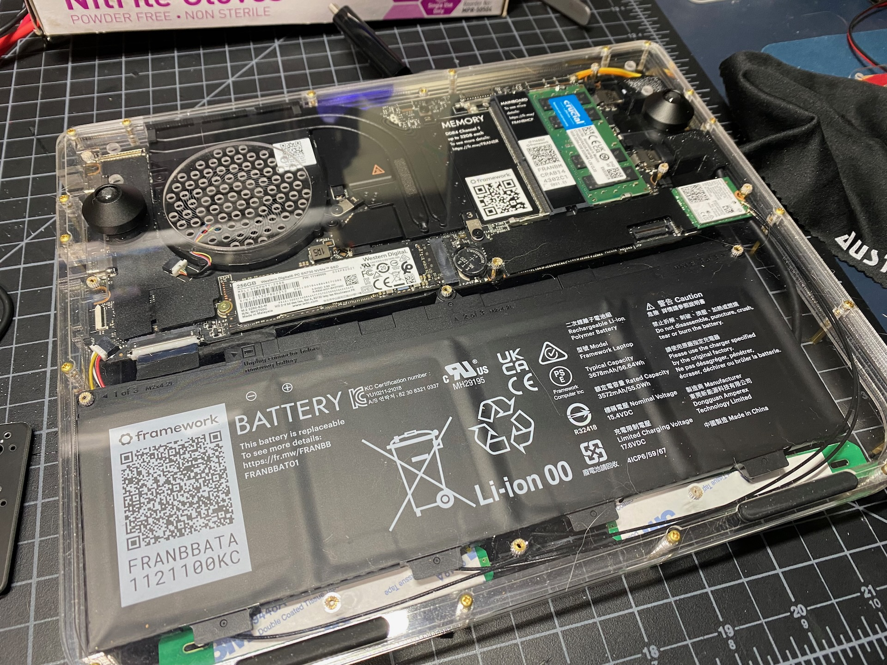
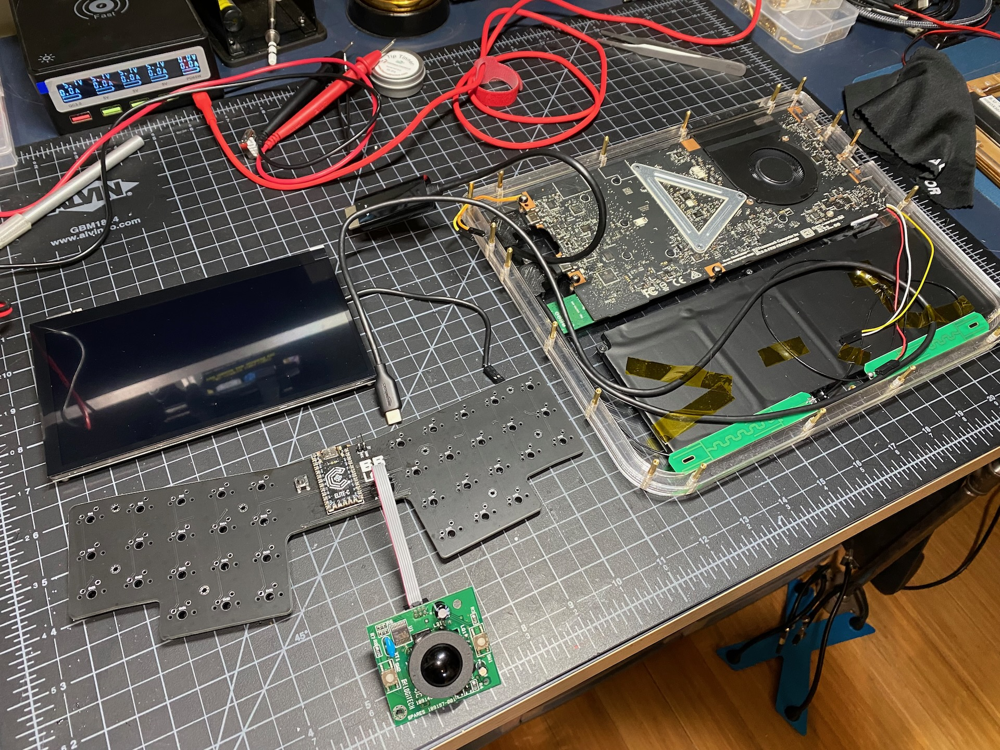
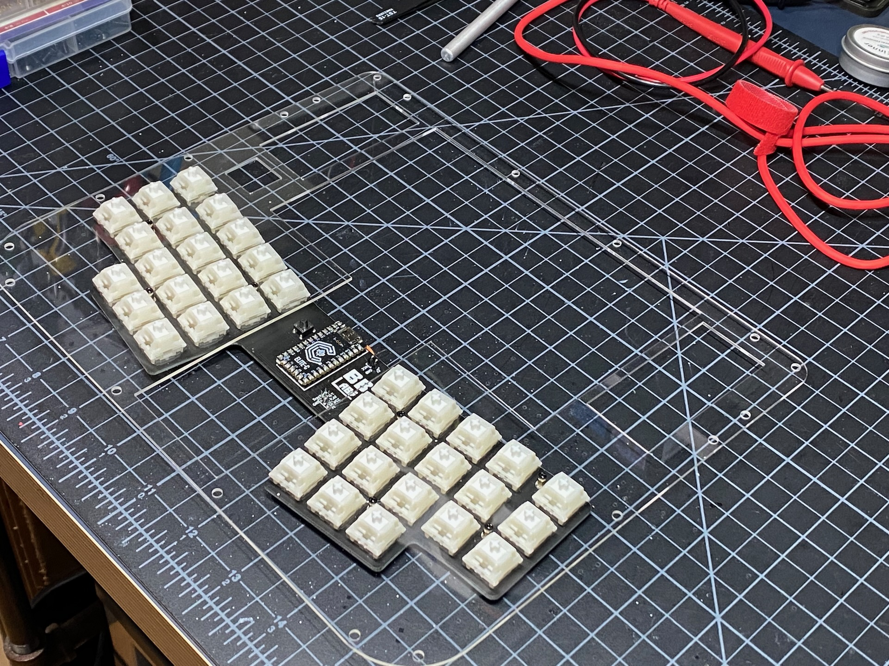
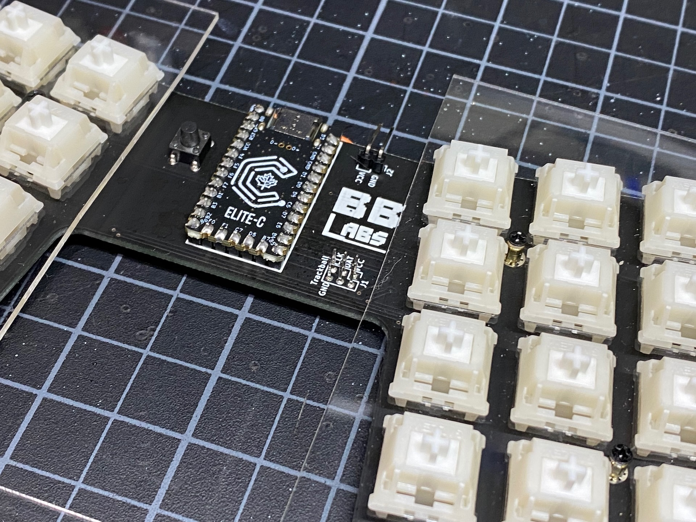
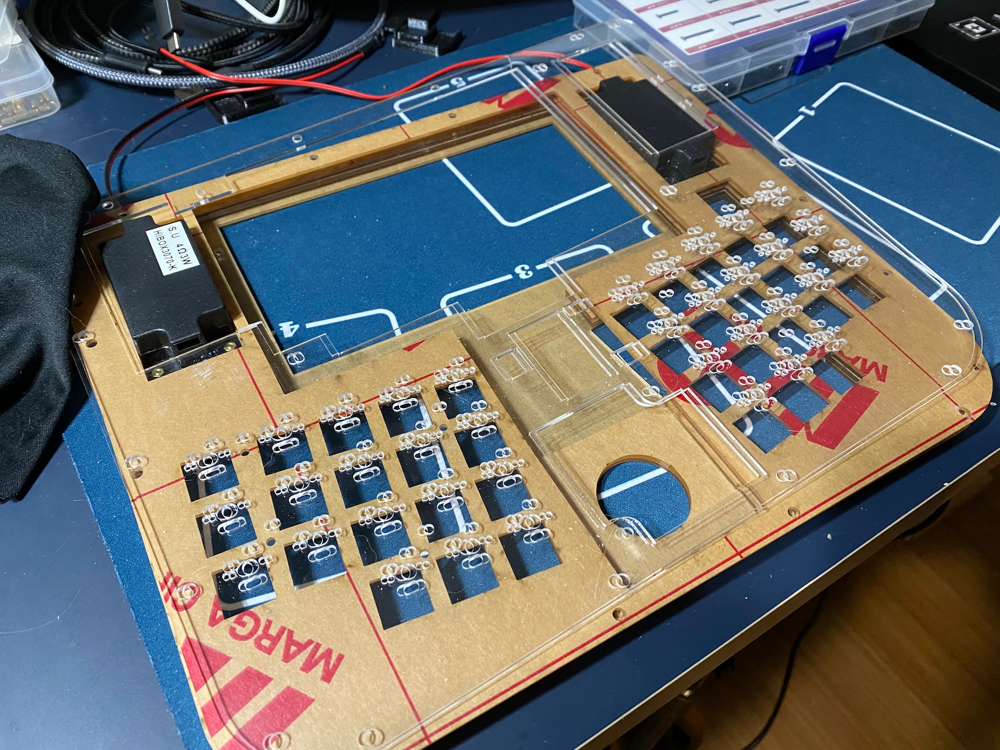
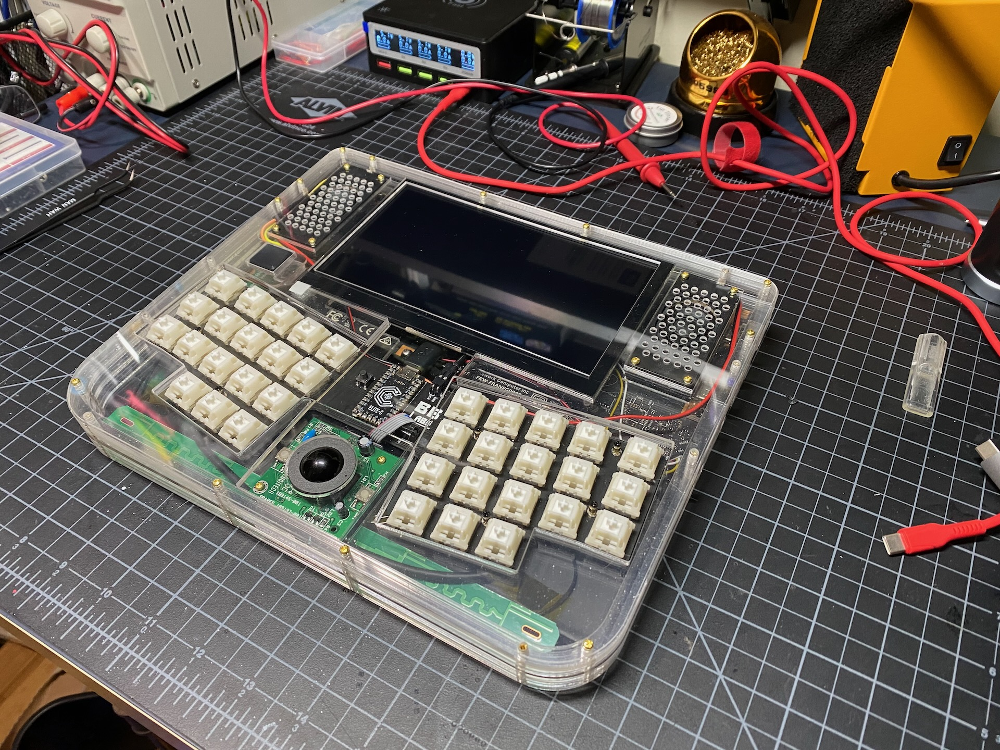
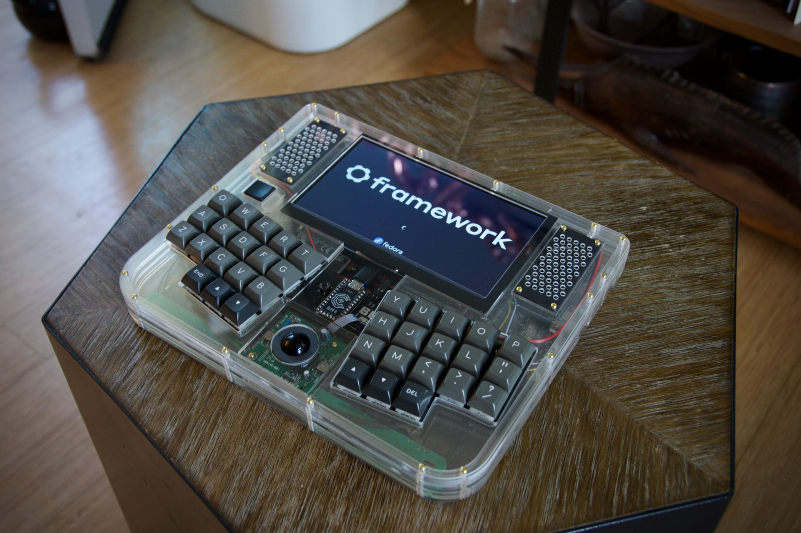

# framedeck - Build Tour

This is not intended to be a full guide, more an inspirational look 
at the build process.  You can review the [Parts list](../docs/parts.md)
to get oriented.  I took all of these photos with my phone as I was building 
so the quality and lighting vary a fair bit.  If you are hoping to build 
something similar and have questions, please reach out and I'd be happy to
answer them!

## Overview

This image shows most of the main components.  The only big thing missing here
is the custom keyboard PCB.  The case is built up from [layers](../case/layers.md) of laser cut acrylic 
of various shapes.  As the stack is built from bottom to top, various components 
are affixed to the acrylic pieces as they are layered on. 

There are four main groupings of layers where particular items attach.

## Mainboard and Battery
The two bottom layers are held together with heat-set inserts.  The layers are 1.5mm each and 
the inserts are 3mm, so they can extend through both layers and secure them together.  This 
also provides the mounting points for the battery and mainboard.  

Here you can see the placement of the mainboard and battery... but in this test fitting session I
installed the battery in the wrong orientation.  I decided to install the mainboard and battery
'upside down' so they would be fully visible from the bottom of the unit.  The mainboard is 
correctly oriented but the battery connector is on the wrong side and the middle mountpoint 
doesn't line up.  This photo does show the small notch in some of the lower layers to 
accomidate the battery.  It has to sit just so in relation to the mainboard as the connector
is short and rather stiff.

I stuck with M2 hardware generally, but had to print up little adapters to fit the larger
mainboard mounting points.  

This bottom 'unit' consists of layers M-I and sandwiches the available USB ports between layers
of acrylic.  It's difficult to see from this photo, but there is acrylic under the USB ports and 
a matching layers sits on top.  Here you can also see the long stand-offs required to sandwich
all the layers together.

This portion of the unit also has the wifi card (plugged into the mainboard), wifi antenna 
(green PCB's at the front of the case),
speaker wires plugged into the mainboads, and some custom made right-angle usb-c connectors 
which are fully enclosed and run the screen and keyboard.  The top is a USB-C to hdmi cable 
and the bottom is a USB-C to USB-C to
plug into the keyboard microcontroller.  Below you can see some of the cable management and 
all the pieces ready to be covered with subsequent layers

Finally, here's a shot of the bottom of the unit with the mainboard and battery presented.  This
also shows the ventilation holes in the case for the mainboard fan.  It vents out the back of the
unit through a nice heatsink assembly which all comes with the mainboard.  Also visible are the 
repositionable conical feet for the back and the low-profile SKUF feet in the front.  This 
provides a bit of a typing angle and makes the screen a little easier to see.

## Screen, Trackball and Power switch

A couple spacer 'E' layers go on top of the bottom assembly and then we get to layer 'H' which
supports the screen and trackball.  They both mount on top of this 3mm layer and secured with 
screws.  The screen has it's own stand-offs and the trackball just has mounting holes.  

I didn't get a better photo of this piece, but there is not much to the assembly except screwing 
the two components to the layer and adding in the required cables.  The monitor gets the HDMI end
of the USB-C to HDMI cable and a micro-USB cable with a dupont connector on the other end to get
power from the keyboard PCB.  It's not pictured above, but the trackball gets a six position ribbon
cable plugged into the header underneath.

Layer 'H' also has cutouts for clearance with the keyboard PCB.  I wasn't sure how close they might
actually sit so I used the same trick as my [slabv](https://github.com/brickbots/slabv) and included
clearance cutouts for all the components.  

There is a spacer layer next, and then the layer that holds the power switch ('F').  This switch 
is a choc low profile momentary switch and it connects via some dupont plugs to a wire soldered on
the footprint for the onboard power switch of the mainboard which I removed.  

## Keyboard and Trackball (again)

The next major assemlby is keyboard.  It uses a custom PCB with an elite-C microcontroller.  This 
provides the interface from the key matrix and trackball to the mainboard.  The custom PCB also 
has a power header connected to the raw USB pins of the elite-C which provides power for the 
LCD panel.

Here's a shot of the assembled PCB, without switches, showing the trackball connected and the power
header.  For more information about building up the PCB, see my 
[slabv](https://github.com/brickbots/slabv) repo.

Layer 'D' serves as the plate for the keyboard.  It is fastened to the PCB using 3mm standoffs, the
switches (Gazzew Boba U4 Silents) get inserted and soldered to the PCB.

Here's a detail showing the power and trackball header along with the MCU and reset switch.

As this layer is installed the USB-C cable, trackball cable and power for the monitor need to be
connected.  It's all a tight fit!

## Top and speakers

The last few layers make up the keyboard and trackball surround and hold the two speakers on
either side of the screen.  Here you can see them from the underside, already mounted to the 
'A' layer which serves as the top of the unit.

Here's the whole thing assembled with all the protective film taken off.  The routing of all the 
cables takes some care and the top layer is secured with screws to the stand offs

And finally with keycaps and fully working with Fedora 35

## Thanks

Thanks for coming along on this tour.  If you have any questions or would like to build something 
similar feel free to reach out.  If you do build something based on the info in this repo, I'd love
to see it!
